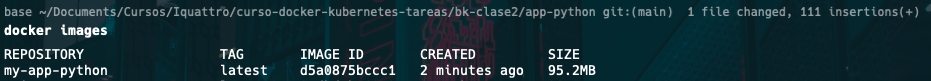
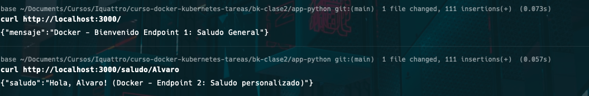
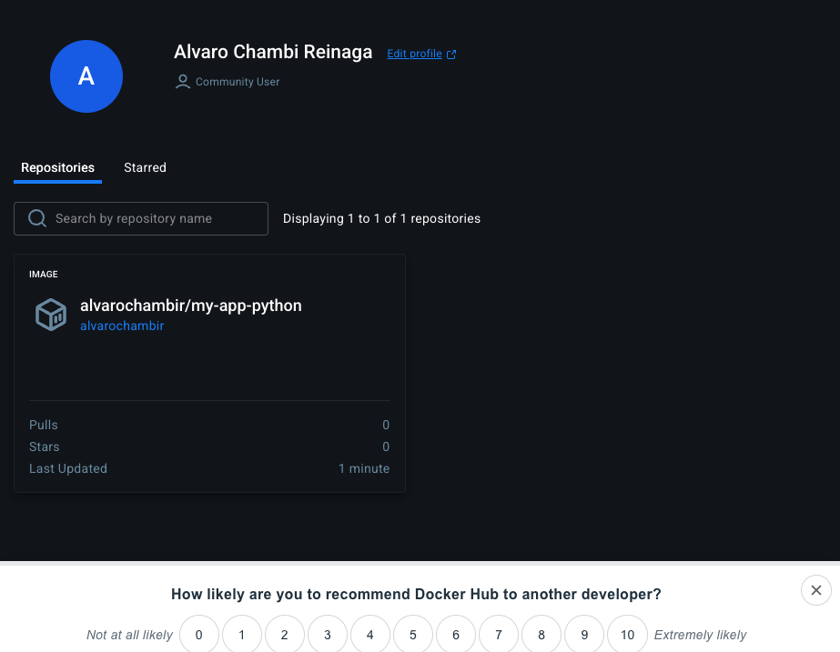

# Clase 2 - Dockerización de Mi Aplicación

## Aplicación

**Lenguaje:** Python
**Framework:** Flask
**Descripción:** API REST de saludo general y especifico

**Endpoints:**
- GET / - Saludo general
- GET /saludo/ - Saludo especifico

## Dockerfile

```dockerfile
# ==========================
# STAGE 1: BUILD (compilación)
# ==========================
FROM python:3.11-alpine AS builder

# Variables de entorno para instalación
ENV PYTHONDONTWRITEBYTECODE=1 \
    PYTHONUNBUFFERED=1

WORKDIR /app

# Copiamos archivos necesarios
COPY requirements.txt .

# Instalamos dependencias en una carpeta temporal
RUN mkdir -p /install && \
    pip install --no-cache-dir --prefix=/install -r requirements.txt

# ==========================
# STAGE 2: RUNTIME (producción)
# ==========================
FROM python:3.11-alpine

# Variables de entorno para runtime
ENV PYTHONDONTWRITEBYTECODE=1 \
    PYTHONUNBUFFERED=1 \
    APP_ENV=production \
    PORT=5000

WORKDIR /app

# Copiamos solo lo necesario desde el build stage
COPY --from=builder /install /usr/local
COPY app.py .

# Crear un usuario no root
RUN adduser -D appuser
USER appuser

# Exponer el puerto (documentado)
EXPOSE 5000

# HEALTHCHECK (opcional, recomendado)
HEALTHCHECK CMD wget --no-verbose --tries=1 --spider http://localhost:5000/ || exit 1

# Labels de metadata
LABEL maintainer="Alvaro Chambi <alvaro.chambi@hotmail.com>" \
      version="1.0" \
      description="Aplicación Flask con multi-stage Dockerfile"

# Comando para ejecutar la aplicación
CMD ["python", "app.py"]
```

**Explicación:**

| Stage | Propósito |
|-------|-----------|
| Build | Se cargas las librerias, definen variables de entorno y carpeta a usar app/ |
| Production | Solo runtime... |

## Build

```bash
docker build -t my-app-python .
```

**Salida:**
```
[+] Building 2.3s (13/13) FINISHED                                                           docker:desktop-linux
 => [internal] load build definition from Dockerfile                                                         0.0s
 => => transferring dockerfile: 1.36kB                                                                       0.0s
 => [internal] load metadata for docker.io/library/python:3.11-alpine                                        2.0s
 => [auth] library/python:pull token for registry-1.docker.io                                                0.0s
 => [internal] load .dockerignore                                                                            0.0s
 => => transferring context: 168B                                                                            0.0s
 => [internal] load build context                                                                            0.0s
 => => transferring context: 687B                                                                            0.0s
 => [builder 1/4] FROM docker.io/library/python:3.11-alpine@sha256:8d8c6d3808243160605925c2a7ab2dc5c72d0e75  0.0s
 => => resolve docker.io/library/python:3.11-alpine@sha256:8d8c6d3808243160605925c2a7ab2dc5c72d0e75651699b0  0.0s
 => CACHED [builder 2/4] WORKDIR /app                                                                        0.0s
 => CACHED [builder 3/4] COPY requirements.txt .                                                             0.0s
 => CACHED [builder 4/4] RUN mkdir -p /install &&     pip install --no-cache-dir --prefix=/install -r requi  0.0s
 => CACHED [stage-1 3/5] COPY --from=builder /install /usr/local                                             0.0s
 => [stage-1 4/5] COPY app.py .                                                                              0.0s
 => [stage-1 5/5] RUN adduser -D appuser                                                                     0.1s
 => exporting to image                                                                                       0.1s
 => => exporting layers                                                                                      0.0s
 => => exporting manifest sha256:ecc5af8e7bfb36d0ff01b2e5631007b35c4ef68c0a485d4fd710265c15a8aca2            0.0s
 => => exporting config sha256:6987b118ede085c31f53a7b19d24807380ea4ac82b00f65d3478d4f7e0d997e2              0.0s
 => => exporting attestation manifest sha256:f1fc555710ff2dbb48153620493e6d132cbe30183e70b85301f0c286730468  0.0s
 => => exporting manifest list sha256:d5a0875bccc1a564eaf8b354d2fdc260c04c8152ce1ac05a94805fb2e6c8b1b1       0.0s
 => => naming to docker.io/library/my-app-python:latest                                                      0.0s
 => => unpacking to docker.io/library/my-app-python:latest                                                   0.0s

View build details: docker-desktop://dashboard/build/desktop-linux/desktop-linux/epwjqso4u7itys7asc2z7yh8h
```

**Tamaño final:** 95.2MB




## Testing
**Docker Images**

**Container running**



## Docker Hub

**URL:** https://hub.docker.com/r/alvarochambir/my-app-python




## Conclusiones
El multistage nos permite separar instalaciones de librerias, de la ejecucion de la app como tal, al igual que el gitlab/github, se puede tener un repositorio de las imagenes que creamos, Dockerfile es una forma de customizar la creacion de la imagen, y por tanto permite instacianar tantos contenedores como se vean convenientes.

Por un problema con repositorio, se nombra esta carpeta bk-clase2, y no clase2, por el factor tiempo no se llega arreglar, mas adelante se lo hara.