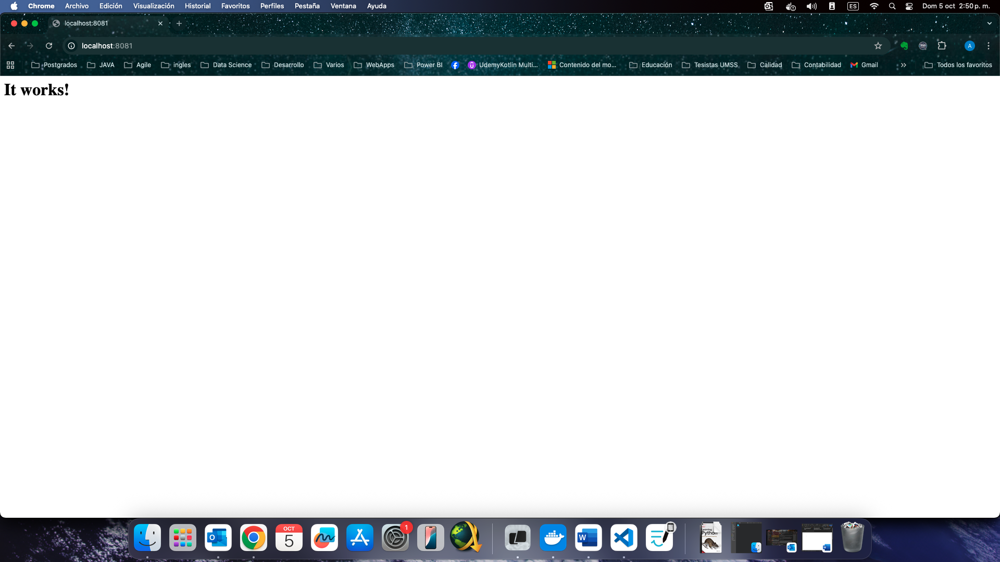

# Clase 1 - Introducción a Containers y Docker

## Objetivo

Practicar el despliegue de diferentes tipos de aplicaciones usando docker run y documentar el proceso de cada una.

## Opcion seleccionada para desplegar
Opción 1: Apache HTTP Server (httpd)
Despliega un servidor web Apache:

Imagen: httpd
Puerto: 8081
Nombre del container: mi-apache
Verifica accediendo a http://localhost:8081

## Desarrollo
Antes de iniciar se verifica todos los contenedores (iniciado y detenidos)

docker ps -a


### 1. Ejecutar el container

```bash
docker run -d -p 8081:80 --name mi-apache httpd
```

**Explicación:** Este comando crea y ejecuta un container con httpd en segundo plano (-d), mapeando el puerto (-p) 8081 de mi mac al puerto 80 del container, ademas se le da el nombre de mi-apache.

**Salida:**
```bash
Unable to find image 'httpd:latest' locally
latest: Pulling from library/httpd
887db3982a68: Pull complete 
e363695fcb93: Pull complete 
4f4fb700ef54: Pull complete 
8c9dc019f7b6: Pull complete 
480284c75fe2: Pull complete 
17aa38de890a: Pull complete 
Digest: sha256:ca375ab8ef2cb8bede6b1bb97a943cce7f0a304d5459c05235b47bc2dccb98cd
Status: Downloaded newer image for httpd:latest
98b17e174b1ff5900e033d534ef491ed1a9c592063f90b5952f973f16deeb6f9
```

### 2. Verificar que está corriendo
Para verificar que el contenedore esta corriendo se hara listara los contenedores iniciados
```bash
docker ps
```
Que muestra lo siguiente:

**Screenshot:**


Tambien se revisa los logs del contenedor:
```bash
docker logs mi-apache
```
**Screenshot:**


### 3. Acceder desde el navegador

Se accede a `http://localhost:8081` y obtuve:



Con todo esto se verifico que el contenedor se levanto.

### 4. Limpieza
Detén el container
Elimínalo
Verifica que ya no existe

## Conclusiones

Aprendí a ejecutar containers en segundo plano y mapear puertos. Tuve una dificultad inicial con el puerto 8080 ocupado, lo resolví usando el puerto 8081 en su lugar.
